# ARM Rop Finder
Find ROP gadgets in ARM disassembly.

## Double Jump
Find back to back controllable gadgets in the form of a register jump near
an epiloge. 

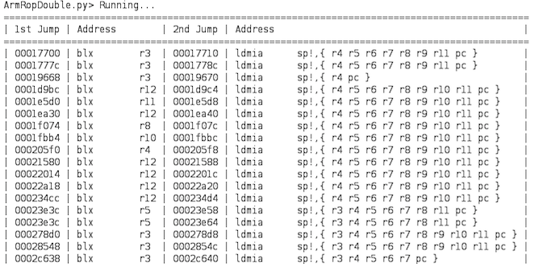

## ArmToThumb
Convert all executable disassembly to Thumb instructions to search for ROP gadgets.
The output of ROP gadets will account for Thumb instructions and display the jump 
address as `ADDRESS + 1 = WHERE_YOU_SHOULD_JUMP`. The operation can be undone 
when finished looking for gadgets.

### Before
ARM disassembly before running the Arm to Thumb plugin.

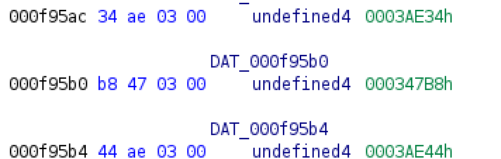

### After
Disassembly after the conversion.

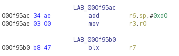

### Thumb Gadget
Thumb gadgets are shown with their actual address, but when jumping to it from 
a ROP gadget you must jump to the address + 1 to switch to Thumb mode.

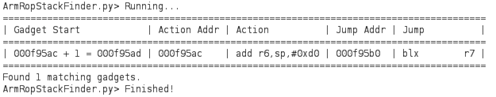

## Find
Find controllable gadgets that contain custom ARM instructions. Regular 
expressions are supported. To search for a move to r0 from anything, simply 
search for 
"`mov r0,.*`".

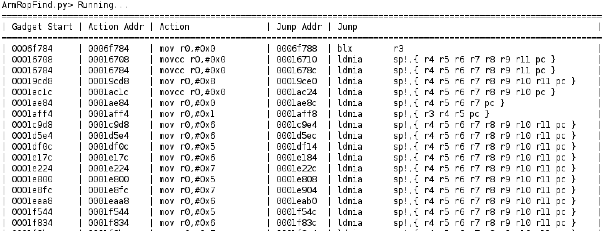

## Move r0
Find ARM ROP gadgets that move a small value into r0. Useful for calling sleep
prior to executing shellcode to flush the buffer to main memory.

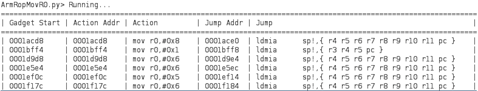

## Register Control
Find ARM ROP gadgets that give control of registers by popping them off the stack.

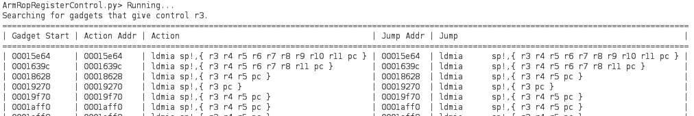

## Register Move
Find ARM ROP gadgets that move values between registers.

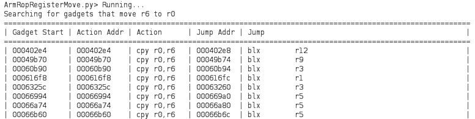

## Stack Finder
Find ARM ROP gadgets that put a stack address in a register. Useful for finding shell code and strings on the stack.

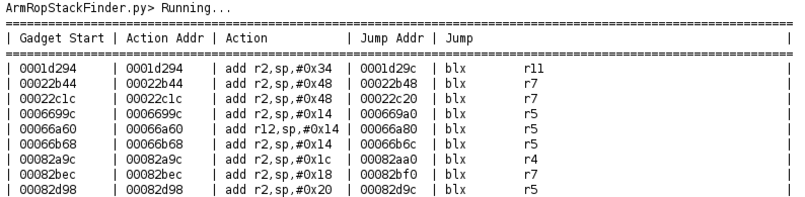

## Summary
Print a summary of gadgets that have been book marked with the string `ropX` 
where `X` is the gadgets position in the rop chain. Don't mix ARM And Thumb 
gadgets with the summary, it won't work. I will fix this.

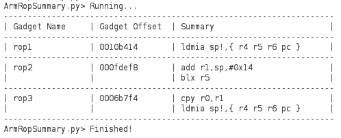

## System
Find ARM ROP gadgets for calling system with a user controlled argument.

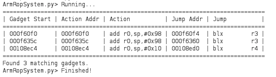

