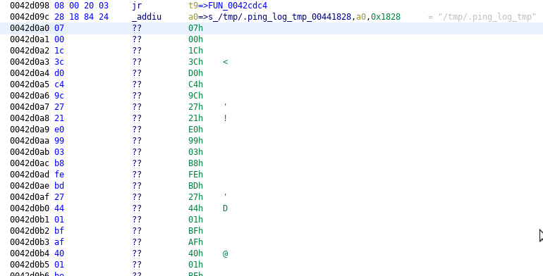
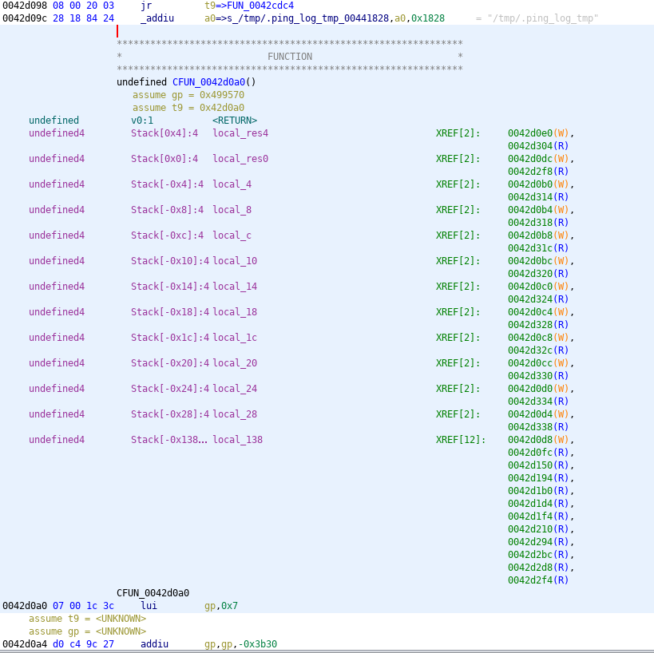
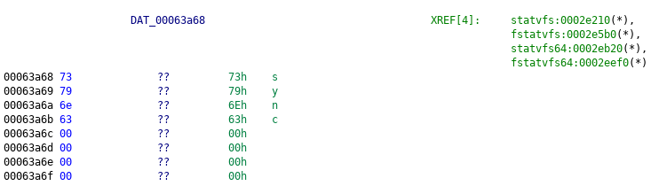
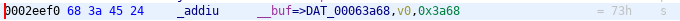
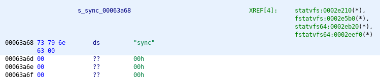

# Codatify

## Fixup Code 
Define all undefined data in the .text section as code and covert it to a 
function if applicable.

### Before

### After

## Fixup Data
Define uninitialized strings and pointers in the code. All other uninitialized
data is converted to a DWORD. Finally, search for function tables and rename
functions based off the discovered tables.

### Before 

**Data Section**

**Cross Reference**

### After

**Data Section**

**Cross Reference**

