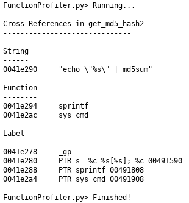

# Function Profiler
Display all cross references from the current function. Will display all 
strings, functions, and labels. Depending on the size of the function, the 
console output size may need to be adjusted to view all the text.

