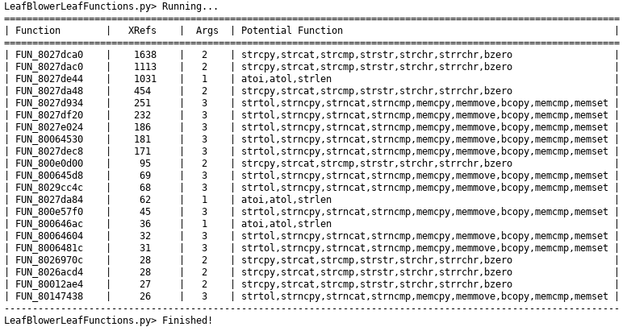
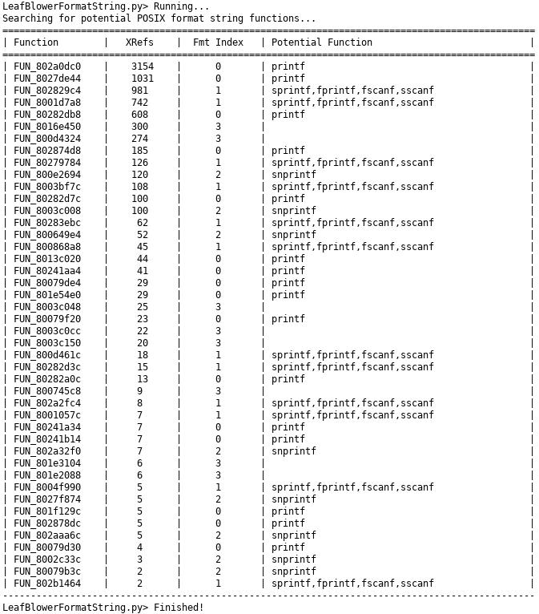

# Leaf Blower 
Identify common POSIX functions such as printf, sprintf, memcmp, strcpy, etc

## Identify Leaf Functions
Identify leaf functions such as strcpy, strlen, atoi, etc.

## Identify Format Parameter Functions
Identify funtions that accept format parameters to identify sprintf, printf, fscanf, etc.

