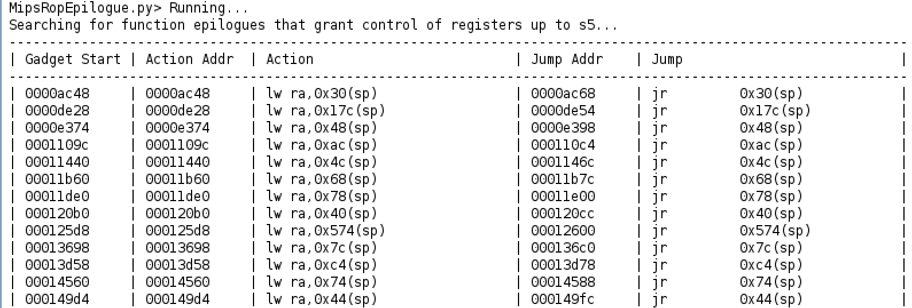
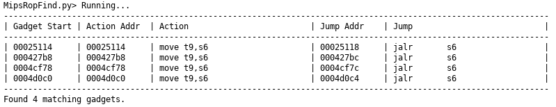
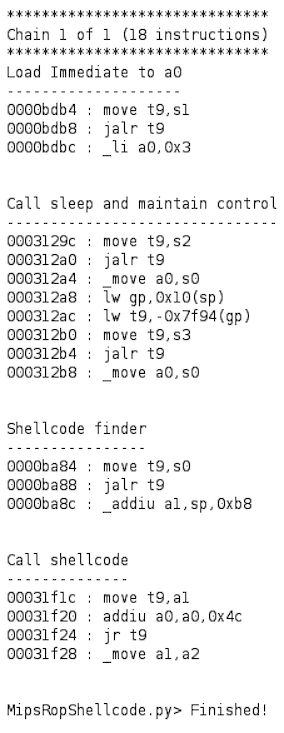
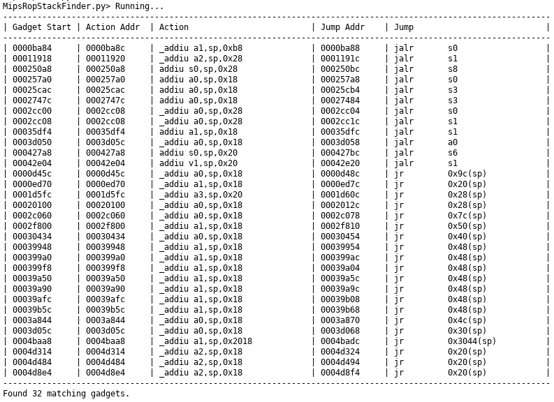

# MIPS ROP Gadget Finder
Find ROP gadgets in MIPS disassembly. 

## Double Jumps
Search for gadgets that contain double jumps.

## Epilogue
Find gadgets that give control of saved registers.

## Find
Find gadgets that contain custom MIPS instructions. Regular expressions are 
supported. To search for a move to a0 from anything, simply search for 
"`move a0,.*`".

## Indirect Return
Find indirect return gadgets. Call t9 and then return to ra.

## Li a0
Find gadgets that load a small value into a0. Useful for calling sleep.

## Prologue
Find controllable gadgets at the beginning of functions that provide stack pointer movement.

## Shellcode ROP Chain
Build rop chain to call shellcode. Chain is built off user intput and attempts
to build the shortest chain. Multiple chains can be requested if the first
is not suitable. If not enough registers are controlled a gadget to gain control
of more register will be used first in the chain.

- Avoid indirect returns
    - Avoid using gadgets that perform jumps to t9 in an epilogue but return to t9. Avoids stack movement.
- Avoid double jumps
    - Avoid gadgets that perform back to back jumps.
- Avoid gadgets that require a control jump
    - If a gadget jumps by controlling an 'a' or 'v' register a gadget will be added to get control of this register. Click this to avoid those types of gadgets.
- Do not reuse gadgets
    - Prevents some gadget reuse. Spices up the results a little bit, but you may not get the shortest chain.
- Verbose Output
    - Print all the outputs.

## System ROP Chain
Build rop chain to call system with a controllable string. Chain is built from
user input and attempts to build the shortest chain using multiple techniques.
Multiple chains can be requested. If not enough registers are controlled 
a gadget to gain control of more register will be used first in the chain.

## Stack Finder
Find gadgets that place a stack address in a register.

## Summary
Print a summary of gadgets that have been book marked with the string `ropX` 
where `X` is the gadgets position in the rop chain. Double jumps can be displayed
by appending `_d` to the `ropX` bookmark name: `ropX_d`.

## System Gadgets
Find gadgets suitable for calling system with user controlled arguments.

