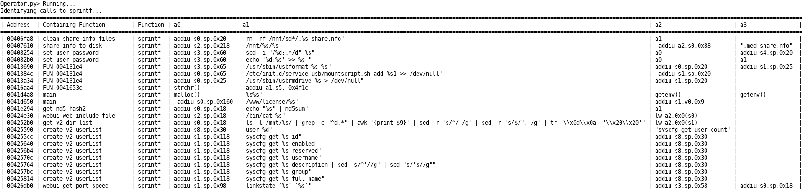

# Operator
Identify calls and the parameters provided to the function when called. The 
script will take into account variadic arguments if they can be identified, 
however, passing argument via the stack will not.

